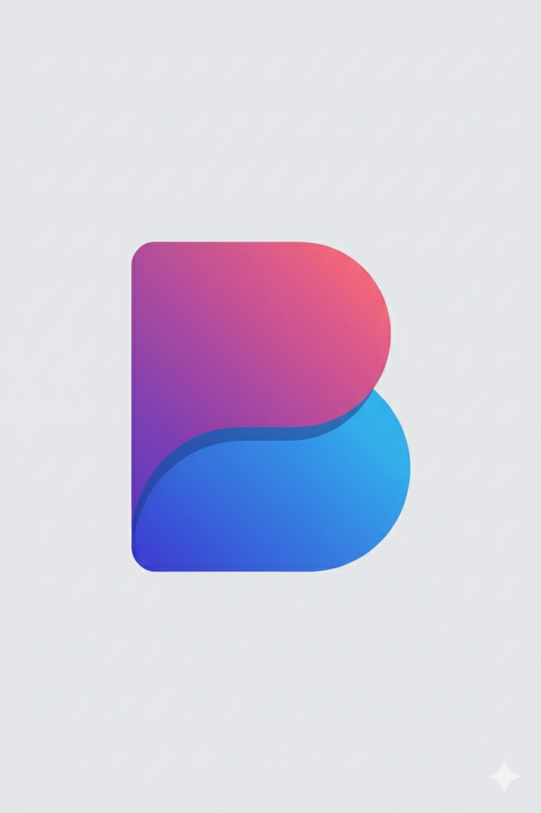

  

<h1 align="center">BrandPixy</h1>

  <b>AI-powered interactive brand identity generator</b> 
  <a href="https://brandpixy.tech" target="_blank">brandpixy.tech</a>

---

## ✨ Overview

BrandPixy helps entrepreneurs, creators, and businesses build a brand identity in minutes using AI — from naming to visual concepts.

---

## 🚀 Features

- **Interactive 3-Phase Flow**  
  Choose your Industry → Vibe → Core Values in a smooth guided experience.

- **AI-Powered Brand Naming**  
  Generates unique names and taglines using Google Gemini.

- **Visual Identity Generation**  
  Creates SVG logo concepts based on the brand DNA.

- **Modern UI/UX**  
  Sleek, minimalist, and animated frontend for an enjoyable user experience.

---

## 🧰 Tech Stack

- **Frontend:** SvelteKit, Vite  
- **Backend:** FastAPI, Python  
- **AI Models:** Google Gemini, DALL-E  
